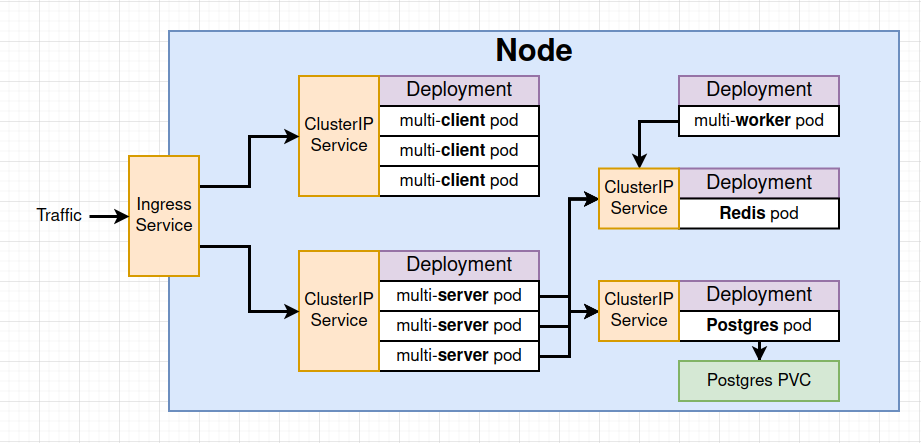
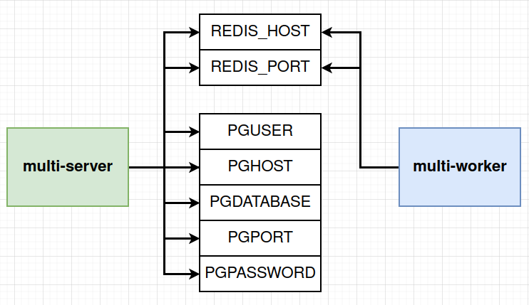
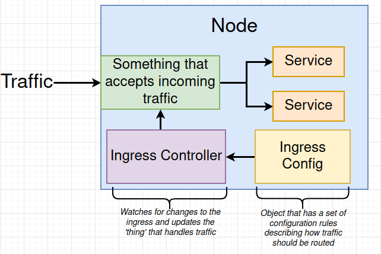
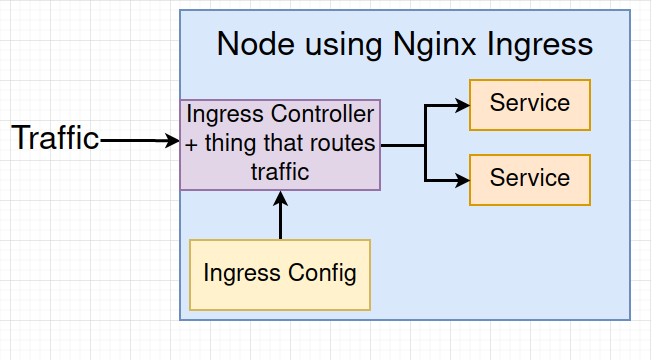
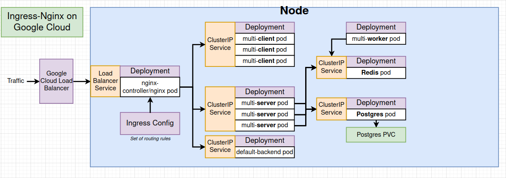

# Multi-Container App with Kubernetes
The overall architecture of our multi-container application is demonstrated below:



_Note: once deployed, we won't be limited to a single node, but it simplifies things for this diagram._

Our 'path to production' is loosely summarized as follows:

1. Create config files for each service and deployment
2. Test locally using minikube
3. Create a GitHub/Travis workflow to build images and deploy
4. Deploy application to a cloud provider

This can be generally be considered a good path to follow for any future projects.

## What is a ClusterIP service?
A __ClusterIP__ service is a service which exposes a set of pods to _other objects in the cluster_. This differs from what we were previously using during development, __NodePort__, in that NodePort exposed pods to the _outside world_. This was useful during development because we wanted to be able to see into our cluster whenever we wanted. However, in production, we don't really want people gaining access to the cluster that way.  
ClusterIP is part of what allows us to control access to the cluster in a stricter and safer way.

### Example
```
apiVersion: v1
kind: Service
metadata:
  name: client-cluster-ip-service
spec:
  type: ClusterIP
  selector:
    component: web
  ports:
    - port: 3000
      targetPort: 3000
```
As you can see, the ClusterIP configuration file differs from the NodePort file in that there is no `nodePort` property (obviously). This is because ClusterIP services do not allow direct access to objects from the outside world, so there is no need to expose a port for that purpose.

## Combining configuration files
Technically it is possible to combine configuration files into a single file. There is no limit to the number of objects you can define within a single configuration file. It might make sense to combine, say, a deployment configuration with it's corresponding clusterip configuration.

The way you would combine these configurations is by separating them through the use of three '-' dashes. For example:

```
apiVersion: apps/v1
kind: Deployment
metadata:
  name: client-deployment
spec:
  replicas: 3
  selector:
    matchLabels:
      component: web
  template:
    metadata:
      labels:
        component: web
    spec:
      containers:
        - name: client
          image: matthewjhcarr/multi-client
          ports:
            - containerPort: 3000
---
apiVersion: v1
kind: Service
metadata:
  name: client-cluster-ip-service
spec:
  type: ClusterIP
  selector:
    component: web
  ports:
    - port: 3000
      targetPort: 3000
```

However, having said that, we will not be doing this in this course for clarity purpose. Having the configuration for each object in its own file makes it immediately obvious how many different objects exist as well as the name of those objects, and allows another dev to easily find the configuration file they need.

## Creating volumes
A PVC works very similarly to a volume. To imagine why we might need something like that consider the following: If we had one single pod running our postgres database, and that pod crashed - what happens to all our data? Gone! Poof!

Obviously, that's not what we want, so we might use something like a volume to ensure that there is a copy of a file system that a database can always be accessed.

This is what we want: we want to create a 'volume' on the _host machine_ that contains some amount of data/a file system. This 'volume' should then always be accessible to the cluster, i.e. it is __persistent__, even if the running instance of postgres crashes.

Now, don't forget, you should always have no more than __one__ independant copy of a database accessing the _same_ volume, because that's clearly a bad idea (think: lockout)

### Different 'Volumes'
#### 'Volume'
A _Kubernetes_ `Volume` is an object that allows a container to store data at the pod level. __This is not the same as a Docker Volume.__

With Kubernetes Volumes, if a container crashes, a newly created container will still have access to the data within the volume, as it has been store at the pod level. However, the trouble is that if the _pod_ crashes, the volume is also lost.

We also have access to two other kinds of objects within Kubernetes: `Persistent Volume` and `Persistent Volume Claim`.

#### Persistent Volume
With a `Persistent Volume`, we are creating some type of long-term durable storage _outside_ of the pod. This means that if either the container _or_ the pod crash, the data will still be available when either that container or pod is recreated. In other words, the volume __persists__.

To associate a persistent volume to a deployment, we would add the following at the top of the `spec` section of our deployment template:
```
spec:
  volumes:
    - name: postgres-storage
      persistentVolumeClaim:
        claimName: database-persistent-volume-claim
```
The `claimName` should be whatever name we give the Persistant Volume Claim in its config file. _See the next section for more information on this._

We also need to assign this storage for use by all the different containers inside our pod. We do this by adding the following to the end of the `containters` section of our template, beneath the ports:
```
spec:
  ...
      volumeMounts:
        - name: postgres-storage
          mountPath: /var/lib/postgresql/data
          subPath: postgres
```
##### name
The `name` of the `volumeMount` __must__ match the `name` of our `volume` defined above.
##### mountPath
This is the path to the directory that we wish to create a volume from. For our purposes, we have specified the path that postgres stores its data.
##### subPath
This is an optional property _(which is **very** specific to postgres)_ that specifies the name of the folder we wish to create within the persistent volume. All of the data from the `mountPath` will be stored inside the persistent volume within a folder named with the value of `subPath`.

#### Persistent Volume Claim
A `Persistent Volume Claim` can be thought of as a billboard advertising hard drives. Bear with me.

A PVC is __not__ an actual volume, it is simply an _advertisement_ of the storage options available within the cluster.

We can use the PVC to specify what Persistent Volumes can be requested from Kubernetes. Kubernetes will then either provide a _statically provisioned_ Persistent Volume (created ahead of time/already available), or will provide a _dynamically provisioned_ Persistent Volume (created upon request), if no appropriate statically provisioned option exists.

The config file for a PVC will looks something like the following:
```
apiVersion: v1
kind: PersistentVolumeClaim
metadata:
  name: database-persistent-volume-claim
spec:
  accessModes:
    - ReadWriteOnce
  resources:
    requests:
      storage: 2Gi
```
##### accessModes
An Access Mode comes in three flavours:

- ReadWriteOnce - can be used by a __single node__
- ReadOnlyMany  - __multiple nodes__ can __read__ from this 
- ReadWriteMany - can be __read by__ and __written to__ from __many nodes__

##### storage
`storage: 2Gi`  
This specifies that Kubernetes will have to find a storage option (statically or dynamically provisioned) that has exactly __2GB__ of space.

`storageclass`  
When we move to _production_, we may need to specify how we want kubernetes to provision storage, since every cloud provider has a different way of doing this _(e.g. Google Cloud Persistent Disk, Azure File, Azure Disk, AWS Block Store, etc.)_.  
If you do not specify anything, k8s will use whatever the default option is on the host machine (e.g. if you deploy to AWS, it will use Block Store)

## Environment Variables
Here's a handy diagrams of all the different environment variables we use:



- REDIS_HOST:
    This will be the name of our redis ClusterIP service (e.g. redis-cluster-ip-service)
- REDIS_PORT:
    This will be the port we defined within our redis ClusterIP service (e.g. 6379)
- PG_USER:
    Whatever user you are using for your pg database. For our purposes we use the default `postgres` user.
- PGHOST:
    The name of our postgres ClusterIP service (e.g. postgres-cluster-ip-service)
- PGDATABASE:
    The name of our postgres database. For our purposes, we are using the default pg database: `postgres`.
- PGPORT:
    The port we defined within our postgres ClusterIP service (e.g. 5432)
- POSTGRES_PASSWORD:
    This must be added in a secure way, since we don't want to expose this password. For this, we will use a `Secret` object.

Here is an example of how we add the environment variables to our server deployment config file:

```
apiVersion: apps/v1
kind: Deployment
metadata:
  name: server-deployment
spec:
  replicas: 3
  selector:
    matchLabels:
      component: server
  template:
    metadata:
      labels:
        component: server
    spec:
      containers:
        - name: server
          image: matthewjhcarr/multi-server
          ports:
            - containerPort: 5000
          env:
            - name: REDIS_HOST
              value: redis-cluster-ip-service
            - name: REDIS_PORT
              value: '6379'
            - name: PGUSER
              value: postgres
            - name: PGHOST
              value: postgres-cluster-ip-service
            - name: PGDATABASE
              value: postgres
            - name: PGPORT
              value: '5432'
```

__NOTE: ENVIRONMENT VARIABLES CANNOT BE INTEGERS. THEY MUST ALWAYS BE STRINGS. IF ENTERING PORT NUMBERS, WRAP THEM IN QUOTES!__

## Secrets
A `Secret` is a kubernetes object that can be used to securely store one or more pieces of information inside of a cluster. For example: passwords, API keys, SSH keys, etc.

To create a secret, we will use an imperative command. This is because we don't want to create the secret using a config file, since writing out the secret in plain text in a config file would defeat the point of encoding it in the first place.

The command we use to create a secret is as follows:
```
kubectl create secret generic <secret name> --from-literal <key>=<value>
```
Creates a secret  
`create`: An imperative command to create a new object  
`secret`: The kind of object we want to create  
`generic`: The type of secret we are creating. The other two types are `docker-registry` (for auth against a custom docker registry) and `tls` (related to HTTPS setup)  
`<secret name>`: The name of our secret for referencing purposes  
`--from-literal`: Indicates that the secret will be entered with this command and not from a file  
`<key>=<value>`: The actual secret as a key-value pair

## Passing Secrets as Environment Variables
In order to pass a secret as an environment variable, we must add the following to our config file:
```
env:
  ...
  - name: PGPASSWORD
    valueFrom:
      secretKeyRef:
        name: pgpassword
        key: PGPASSWORD
```
#### name
This is the name of our __environment variable__. This is _unrelated_ to the actual secret.
#### secretKeyRef
##### name
This is the name we defined when creating the secret. We would be able to see this name listed if we used the `kubectl get secrets` command.
##### key
This is the key from the key-value pair of our secret. In this specific case, it is also `PGPASSWORD`, but generally it would be whatever was used on the LHS of the '=' operator in the `kubectl create secret...` command.

## Traffic Control with Ingress
### The duality of man. Er, projects.
In this project, we will be using __ingress-nginx__. This is a _community led project_ run by people involved in kubernetes. [Here](https://github.com/kubernetes/ingress-nginx) is the github.

The is a _completely separate_ project called __kubernetes-ingress__. This project is led be _the company nginx_. The github repo can be found [here](https://github.com/nginxinc/kubernetes-ingress).

It is __very easy__ to mix up documentation for these two projects. Please make sure you're looking at the right one.

### A few notes on setup
The setup of ingress-nginx changes depending on what environment you are setting it up on (local, Google Cloud, AWS, Azure, etc). In this course we focus on Google Cloud and local setup.

### Ingress Controller
In Kubernetes, a 'controller' is any object that constantly works to make some desired state a reality inside of our cluster.

A 'Deployment' is one kind of Controller, in that it constantly works to make sure a certain number of pods exist configured in a specific way.

We also will create an 'Ingress Controller' which will work to ensure that the routing setup matches our desired setup, which we define through Ingress routing rules within a config file.

A high level illustration of this setup might look like this:



The implementation we are using actually combines the controller and the router, so it actually looks more like this:



But these diagrams are basically the same.

### Google Cloud architecture
The architecture of our application when deployed to Google Cloud will look more or less like this:



The important thing to note in this diagram are as follows:

#### GC Load Balancer
The way Google Cloud actually handles routing traffic behind the scenes is through use of a Load Balancer. We don't have to concern ourselves too much with this detail, it's just useful to know.

GC routes traffic from it's cloud provided load balancer to a local load balancer service attached to our ingress-nginx deployment.

#### Ingress-nginx Deployment
This deployment contains our Ingress Controller and an Nginx pod. The controller watches for changes and updates the nginx pod when necessary, and the pod routes traffic to the appropriate ClusterIP services.

#### Default backend deployment
This default-backend deployment is used for a series of health checks to ensure that the cluster is working as expected.

In an ideal world, we would replace the default-backend pod with our Express API server. This would allow the nginx pod to reach out to the Express API server when performing health checks. We will cover how to do this later.

### Ingress setup
To install the ingress add-on locally, use the following command:

__LINUX__
```
minikube addons enable ingress
```

__WINDOWS__
```
TODO
```

__MAC__
```
TODO
```

### Ingress configuration
The configuration file for the ingress server should look something like this:
```
apiVersion: networking.k8s.io/v1
kind: Ingress
metadata:
  name: ingress-service
  annotations:
    kubernetes.io/ingress.class: nginx
    nginx.ingress.kubernetes.io/use-regex: 'true'
    nginx.ingress.kubernetes.io/rewrite-target: /$1
spec:
  rules:
    - http:
        paths:
          - path: /?(.*)
            pathType: Prefix
            backend:
              service:
                name: client-cluster-ip-service
                port:
                  number: 3000
          - path: /api/?(.*)
            pathType: Prefix
            backend:
              service:
                name: server-cluster-ip-service
                port:
                  number: 5000
```
#### annotations
Annotations are additional configuration options that specify higher level configuration options around the ingress object that gets created.

`kubernetes.io/ingress.class: nginx`  
This tell k8s that we want to create an Ingresscontroller based on the nginx project

`nginx.ingress.kubernetes.io/use-regex: true`  
This tells nginx that we want to use regex on our routes

`nginx.ingress.kubernetes.io/rewrite-target: /$1`  
This tells nginx that we want to rewrite any routes with a leading `/api` and remove `/api`.

#### rules/http
The `rule` property is an array where we define our routing rules.

The `http` property just specifies that these are rules for http routing

##### paths
The `paths` property is an array consisting of individual routing rules where we define the following:

`path:` The path this rule applies to  
`pathType:` Where in the URL this path occurs (i.e. prefix, suffix, etc)  
`service:` The service (probably a ClusterIP service) we want to route traffic to if the path matches  
`name:` The name of the service  
`port:/number:` The port number exposed by that service.